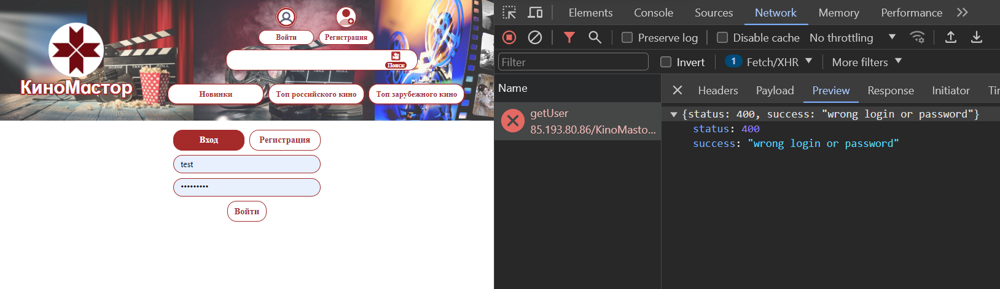

1. Ошибка при логине не выводится 
2. Ошибки принято отображать красным цветом 
3. Стоит поработать над UI. Как пример, такое выравнивание  выглядит лучше чем вот
   это 
4. Стоит прибраться тут немного 
5. Вместо создания и сохранения иконок используй готовые инструменты типа https://fontawesome.com/icons?d=gallery&p=2
так тебе не нужно будет париться о том чтобы скачать иконку и тп. Просто берешь нужную и юзаешь
